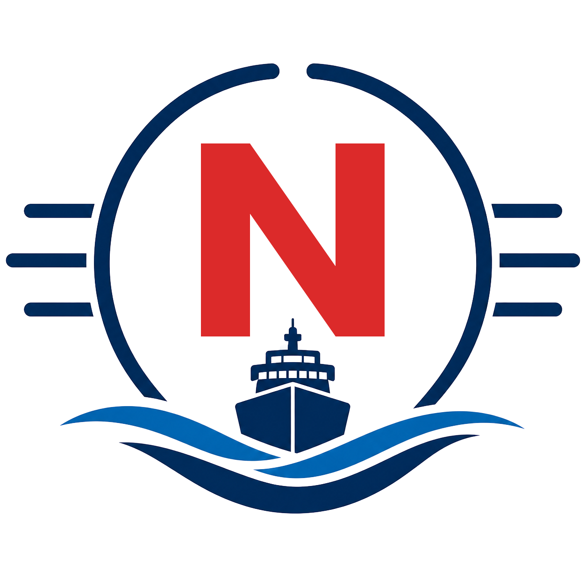

<p align="center">
  
</p>

# Navium Maritime Plugin Marketplace

Claude plugins and skills from Navium Maritime Shipping Services Private Limited (NMSSPL), a New Delhi-based maritime consultancy.

## Add the marketplace

In Claude Code:

```
/plugin marketplace add puneet6969-a11y/linkedin-skills
/plugin install navium-linkedin@navium-maritime
```

In the Claude desktop app, open the Plugins area, add a marketplace, and enter `puneet6969-a11y/linkedin-skills`. Then install `navium-linkedin`.

## Plugins

| Plugin | What it does |
|---|---|
| `navium-linkedin` | 13 LinkedIn skills, including a Navium brand skill (`navium-linkedin-brand`) that applies Navium's maritime voice, audience, content pillars and commercial positioning to every post, comment, reply and content plan. |

### navium-linkedin skills

Post writer, comment drafter, reply handler, hook extractor, humanizer (rewrite and pre-publish audit), profile optimizer, content planner, content repurposer, employee advocacy, thread monitor, engager analytics, interviewer (Story Bank), and `navium-linkedin-brand`.

Every skill drafts first and waits for approval. Nothing is published, scheduled or sent without your explicit go-ahead. Publishing through Publora, reading through Apify and image generation through Pixfaro are all optional; without keys the skills work in draft-only mode. Copy `plugins/navium-linkedin/.env.example` to `.env` inside the plugin folder to enable them.

## Repository layout

```
.claude-plugin/marketplace.json     marketplace catalogue (navium-maritime)
assets/navium-logo.png              Navium Maritime logo
plugins/navium-linkedin/            the navium-linkedin plugin
  .claude-plugin/plugin.json
  skills/                           13 skills
  references/                       shared hooks, voice rules, story bank, Navium brand profile
  lib/, scripts/                    optional Publora / Apify / Pixfaro clients
```

New Navium plugins go under `plugins/<name>/` with an entry added to `.claude-plugin/marketplace.json`.

## Credits and licence

`navium-linkedin` is based on [linkedin-skills](https://github.com/sergebulaev/linkedin-skills) by Serge (Sergey) Bulaev, used under the MIT licence. Navium Maritime added the brand skill and brand profile and restructured the package. Some reference documents still cite the upstream author's own examples and data points. MIT licence, see [LICENSE](LICENSE).
